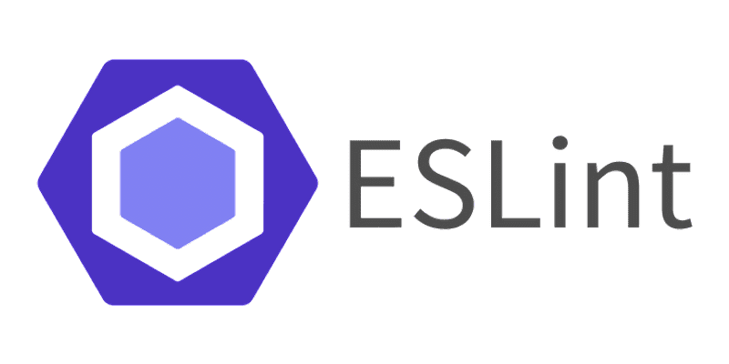

  

## ESLint
There are many different code standards, but I have just started using ESLint to inspect and analyze my JavaScript code for styling problems, such as spacing and bracket placement. Typically, I start coding with this inspector turned on, so I can see the mistakes as I go and learn to avoid them in the future as I code, but there is an option to fix inconsistent styles automatically too. Coding standards can increase efficiency, readability, and make a consistent language.

## Efficiency
I use coding standards to write consistent code. I don’t need to question whether to add an additional space here and there since it is all defined in the standards. With the built-in inspectors, they catch these quick problems, and when using IntelliJ, they also provide automatic quick fixes. The addition of an inspector does not take much time away from actually coding since it checks the code automatically and can provide automatic fixes, so it does not take additional time to fix these problems.

## Readability
If there are multiple people working on the same project, then each developer must be able to read each other’s code. Coding standards makes code easier to read since it limits the formatting that could be done on different lines of code, like for-loops, or inline functions. Readability is important to prevent misinterpretation of code and to understand the code by itself instead of asking the developer who rode it. Code is more likely to be self-documenting with coding standards.

## Language
Computer science languages are just like any other language. In primary school, we are taught the rules of commas, colons, and sentence formation. I think these similar rules should be applied to coding languages. It helps to communicate information in a normal way for many people to understand. There is a beauty when you can put your program in one line of code or set in cool formats, and I compare those to poems. Though coding standards set rules on how to write code, there is still no limitation for how creative you can be with formatting and spacing.
