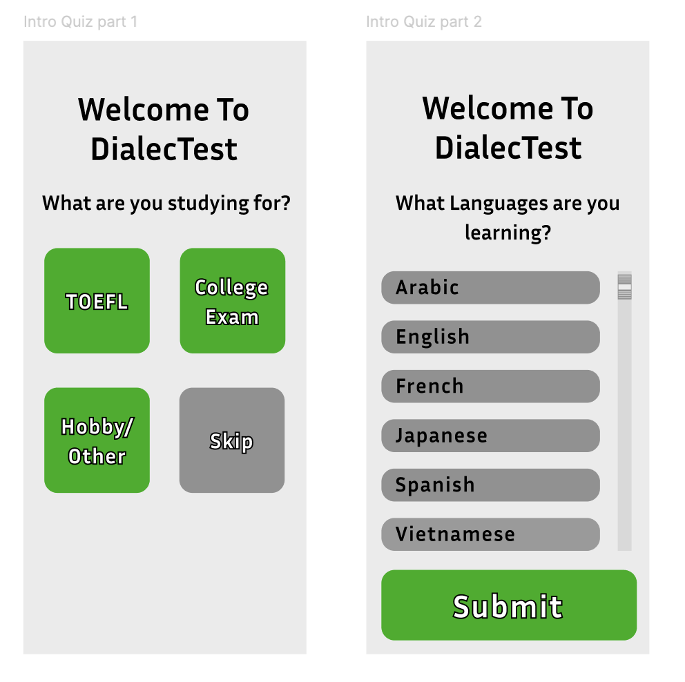

  

Please view entire prototype here: <a href="https://www.figma.com/proto/afUq5js7K0THnludreyp5C/ICS466?node-id=22-11&t=f3yiWyBvCTkI5X3g-1" target="_blank">https://www.figma.com/proto/afUq5js7K0THnludreyp5C/ICS466?node-id=22-11&t=f3yiWyBvCTkI5X3g-1</a>

<b> Problem Statement:</b> Even with primary education, adults struggle to study for examinations, have a more difficult time learning new languages as they age and not all primary schools emphasize on different ways of effective studying. We need to implement productive and effective study solutions for those learning second, third, or multi languages.

<b>Target Audience:</b> This application is for young adults who have finished high school. They are studying for a language test like TOEFL or a college language test. They are not native speakers of the second language, and they are looking to improve their skills and communication in it.

 
 
 
