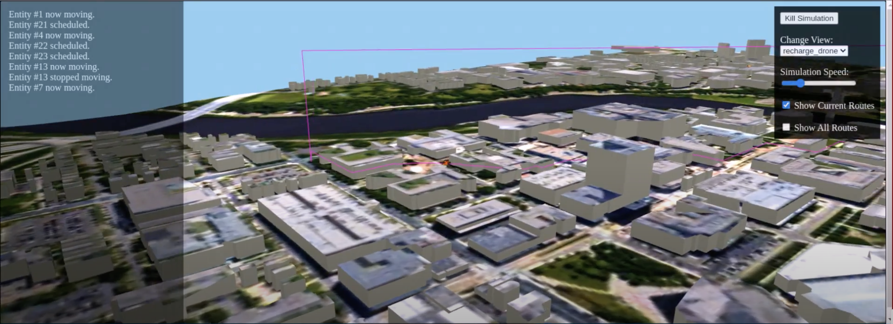

  

This was a project assigned in a course about program design and development. I used the given graphics to add and manipulate a drone to go to pick up a package and go to a customer on a given map. This was one of my first real world applications of computer science. The drone was able to move across a path on the road or in a parabolic path over buildings. This large group project required us to establish roles and a ticket-like system, so we could simultaneously work on the assignment without merge conflicts. 

I learned how to efficiently communicate tasks to my group mates and strengthened my pair programming skills. We needed to write code that was DRY (Does Not Repeat) and extendable. We used a factory pattern to manipulate the entities (drone, customer, packages). I learned about Google Tests, and one of my biggest roles in the group was writing tests for each method to ensure the program had no bugs. This was one of my favorite projects and one of my favorite groups. I am excited to continue working on a team with projects of similar size and style.

 
 
 
