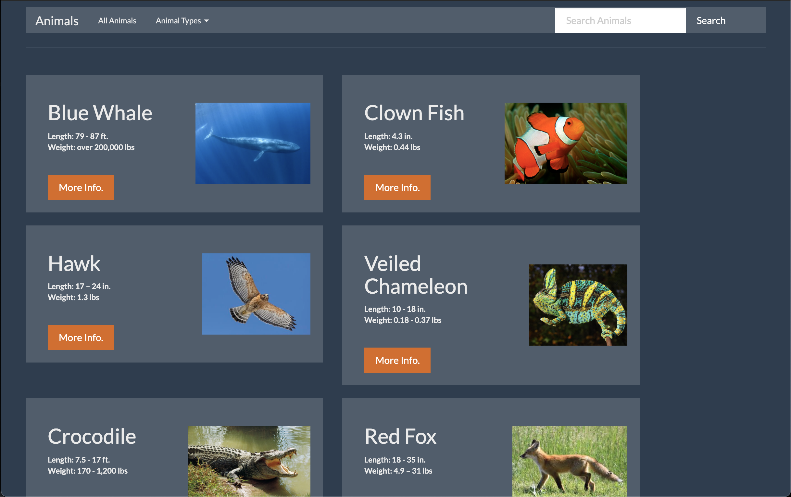

  

During the end of my software engineering internship, I had time to work on a personal project. The team I was working with focused on modernizing and refactoring the webpages to Angular. I was able to learn Angular on my own and start my own website in Angular. I took about two weeks on this project, and it turned out great for my first time coding in Angular.

Throughout my two weeks on this project, I was following an Angular tutorial of getting started while adding my own customizations. I was able to jump between tutorial videos and Google search for all of the features in my website. I was able to implement a navigation bar where "All Animals" is a button that leads to the home page, and "Animal Types" is a dropdown menu that displays different animal types: mammals, fish, birds, reptiles, and amphibians. I also have the animals displayed on an animal-list component and when the "More Info." button is clicked, it would direct the user to a new page displaying more details on the specific animal that was selected.

I learned about time management. I wanted to get as many features in this website as possible, so I had to schedule certain hours to work on different tasks. When I didn't have enough time to finish a feature (e.g. the search bar), I moved on to another task, and if I had time, I would go back.

 
 
 
