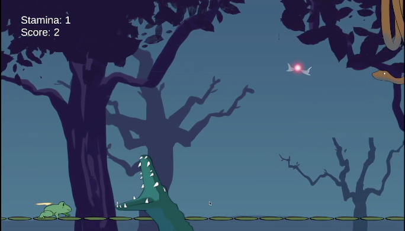

  

Game play: <a href="https://jeannepc.itch.io/lily-leaper" target="_blank">https://jeannepc.itch.io/lily-leaper</a>

This game was created on Unity with two developers and one graphic design artist. Using the listed controls, you can fly over obstacles and predators and eat magical flies to gain power-ups.

  

 
 
 
