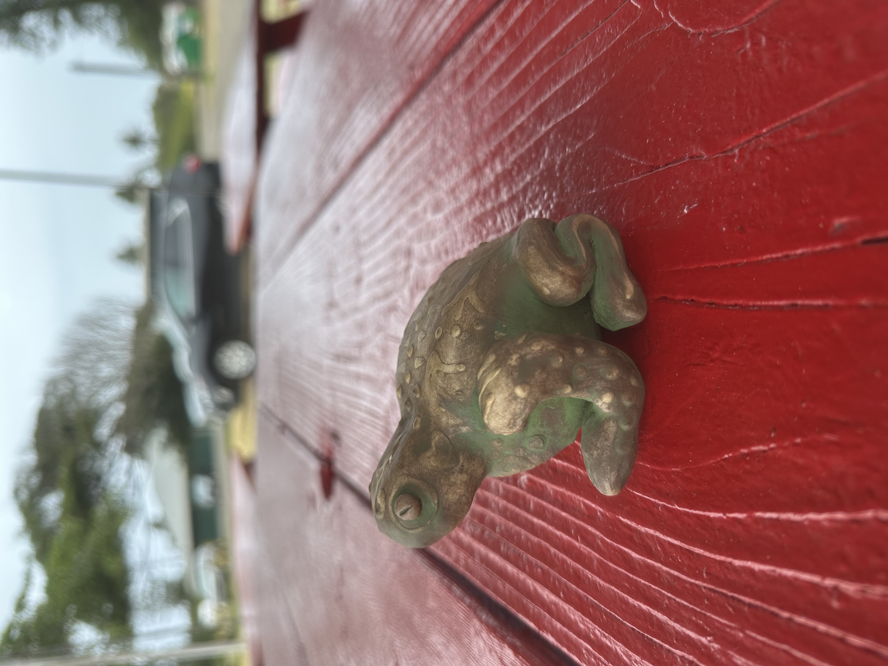
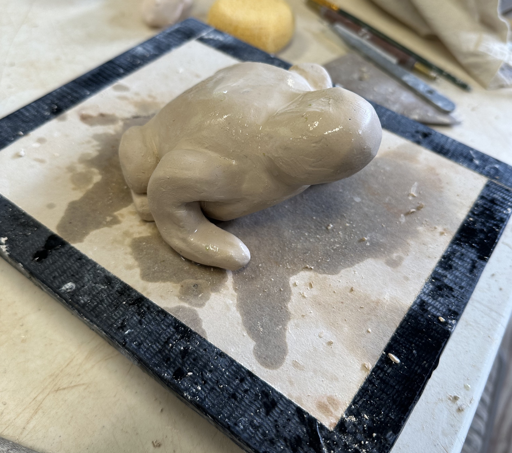
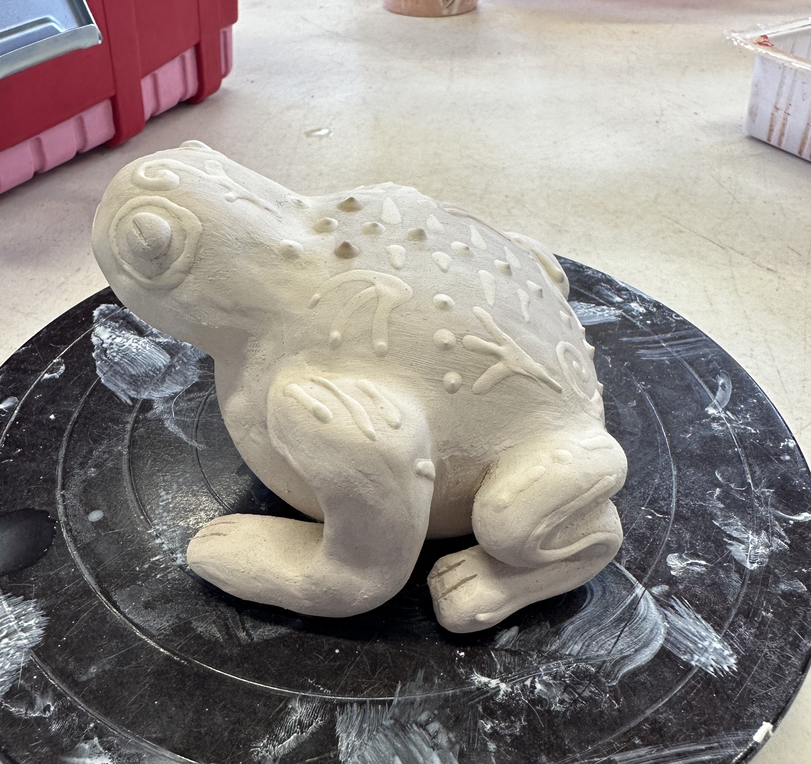

  

After graduating from college, I moved away from my childhood family in Minnesota to my new family in Hawai’i. I got to live with my husband on this beautiful island of O’ahu. I didn’t have any old friends here or know much about anything, but I knew I wanted to be more creative with my life after academia. I found a ceramic studio located in Honolulu right by the University of Hawai'i at Manoa, where I attended one semester. This studio brought back warm feelings of where I once lived in town. I can walk from my studio to my old apartment in less than ten minutes.

I studied under three amazingly talented female teachers at Hawai’i Potter Guild (HPG). However, this is not the first time I fell in love with clay. One of my first teachers was Lazare Rottach at a community college in Bloomington, MN. That class that I took four years ago has stuck with me throughout state and ocean borders. Now, I am more experienced than ever in ceramic handbuilding after learning more about compositions, themes, ocarinas, rattle brains, planters, and many many more things. I have decided to learn more about the wheel too. I am still a rookie at it, but I haven’t given up yet.

My first animal ocarina was a frog. An ocarina is a wind instrument, so when wind passes through my ceramic piece, like a flute or whistle, it makes a tone. I was quite ambitious when starting this because I saw this round cone shaped object, and I told myself I could make it into a frog. After a couple of weeks of attaching the limbs and getting the shape right, I knew I needed to add more to it. I used slip-trail and went all along the outside to add detail and pattern to my frog and into the bisque kiln it went. When it was out, I added an oxide on it to give it its color and high fired it to the final piece, my favorite piece.

  

  

This creative outlet is something I cherish after being so academically focused all my life. Don’t get me wrong, I love school and plan on going back to college, but I didn’t have as much time to play and work with my hands to create art that I love and can show to the world.

 
 
 
