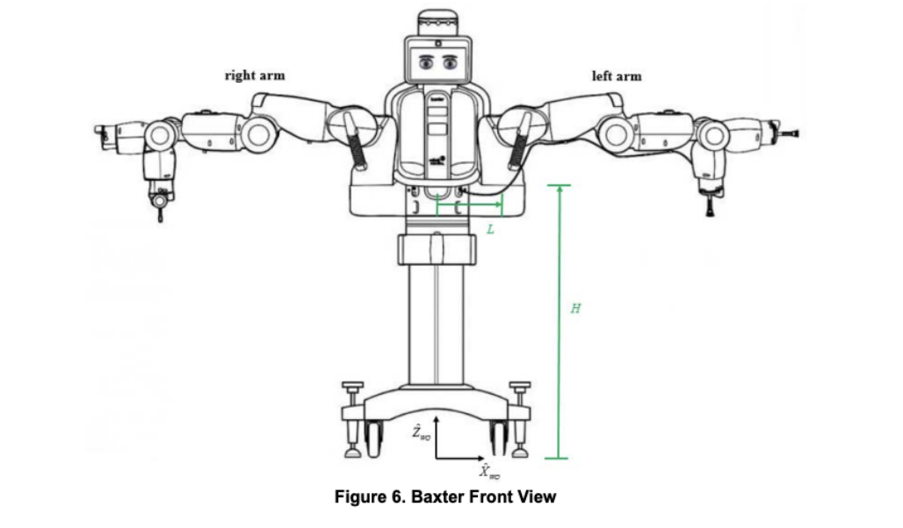

  

In this project, we propose a framework for performing robotic injections. We demonstrate one way to automate injections in humans. We use  forward and inverse kinematics on a humanoid manipulator robot, Baxter by Rethink Robotics,  coupled with a computer vision algorithm, implemented on an intel - real sense camera module, to detect the human pose and make a precise robotic arm maneuver to emulate impaling a human subject. Our code, which is written using python and implemented using ROS noetic, is optimized for implementing this task on the real robot in real-time. We have also performed a coordinate transformation from the camera to the robot frame of reference as well to achieve the required end effector motion in space. Automating human injections is especially relevant in the age of the COVID-19 pandemic. This can help our front line health workers and medical professionals, who are in direct contact with patients while performing vaccinations. A robot can simply allow them to be at a safe distance from the subject while overseeing the procedure. No needles or sharp objects were used in this demonstration.

The demonstration included a subject (human) in front of the Baxter robot where its camera was able to detect. The camera read the information and our code was able to detect the location of each joint on the subject. The Baxter robot was instructed to move one of its arms to the upper arm region and make contact with the arm. Once it made contact, it would give a slight nudge forward, simulating an injection. Then the arm would retract in the same line of motion and be put back into a resting position, away from the subject.

 
 
 
